<p align="center"></p>
<h1 align="center">Vue3 Admin</h1>
<p align="center">前端的全栈之路</p>

## ☘️ 项目简介
[Vue3 Admin](https://vue3.baiwumm.com/) 是一个前端基于 [Soybean Admin](https://docs.soybeanjs.cn/) 二次开发，后端基于 [Nest.js](https://nestjs.com/) 的全栈后台应用，适合学习全栈开发的同学参考学习。

- 🍁 前端技术栈： [Vue3.5](https://cn.vuejs.org/)、[Ant Design Vue](https://www.antdv.com/)、[UnoCSS](https://unocss.dev/)、[Pinia](https://pinia.vuejs.org/)


- 🍁 后端技术栈： [Nest.js](https://nestjs.com/)、[PostgreSQL](https://www.postgresql.org/)、[Prisma](https://prisma.yoga/)

- 🍂 线上预览： https://vue3.baiwumm.com/

- 🍃 用户名：**Admin**，密码：**abc123456**

- [🪹 github 仓库地址](https://github.com/baiwumm/Vue3-Admin/)

- [🪺 码云仓库地址](https://gitee.com/baiwumm/Vue3-Admin/)

- [🍀 Swagger 接口文档](https://vue3.baiwumm.com/docs)

- ❤️ star：**如果可以的话，请顺手给个star，表示对作者的鼓励，万分感谢！**

## 🌿 系统功能设计
1. 动态国际化语言配置
2. 记录登录用户的 `CURD` 操作日志
3. 用户和角色权限的一对一映射，根据角色关联的菜单权限生成动态路由菜单
4. 登录用户发布消息公告，后端使用 `SSE` 推送，可登录多个用户查看效果
5. 前端常见的一些实用的业务功能或者一些有趣的效果

## 🌳 环境和依赖
> 推荐本项目使用 [pnpm](https://github.com/pnpm/pnpm/) 包管理工具
- [Git](https://git-scm.com/) (你需要git来克隆和管理项目版本)
- [Node.js](https://nodejs.org/) (Node.js 版本要求 >= 18.12.0，推荐 18.19.0 或更高)
- [Pnpm](https://github.com/pnpm/pnpm/) (>= 8.7.0，推荐最新版本)
- [PostgreSQL](https://www.postgresql.org/) (推荐最新版本)

## 🌴 项目运行

1. 拉取项目代码
```bash
git clone https://github.com/baiwumm/Vue3-Admin.git
cd Vue3-Admin
// 进入前端
cd web
// 进入后端
cd server
```

2. 安装依赖
```
npm install -g pnpm
pnpm install
```

- 开发模式运行
```
// 前端启动
pnpm dev
// 后端启动：开发模式
pnpm start:dev
```

- 编译项目
```
pnpm build
```

## 🌵 新增路由菜单
1. 在 `web/src/views` 目录下新建 `文件夹/index.vue` 文件
2. 在菜单 `系统管理-国际化-route` 中添加路由配置
3. 在菜单 `系统管理-菜单管理` 中按照规则添加菜单，可打开多个标签页参考，路由配置参考：[系统路由](https://docs.soybeanjs.cn/zh/guide/router/intro.html)
4. 在菜单 `系统管理-角色管理` 中编辑状态中勾选相应的菜单，保存刷新页面，即可看到路由菜单生效

## 🌱 功能模块

```
- 登录 / 注销

- 首页

- 智能行政
  - 消息公告
  - 组织管理
  - 岗位管理
  - 组织架构

- 个人中心

- 功能页
  - 验证码
  - 打印
  - 拾色器
  - 甘特图
  - 图片预览
  - 自定义 Vue 指令
  - 懒加载
  - 图片取色盘
  - 系统级取色器
  - 文件预览
  - 流程图
  - 瀑布流
  - Swiper

- 技术文档
  - Soybean（内链）
  - Vue3
  - Nest.js
  - Ant Design Vue
  - UnoCSS

- 系统设置
  - 用户管理
  - 菜单管理
  - 角色管理
  - 国际化
  - 操作日志

- 关于

```

## 🪴 演示图

| 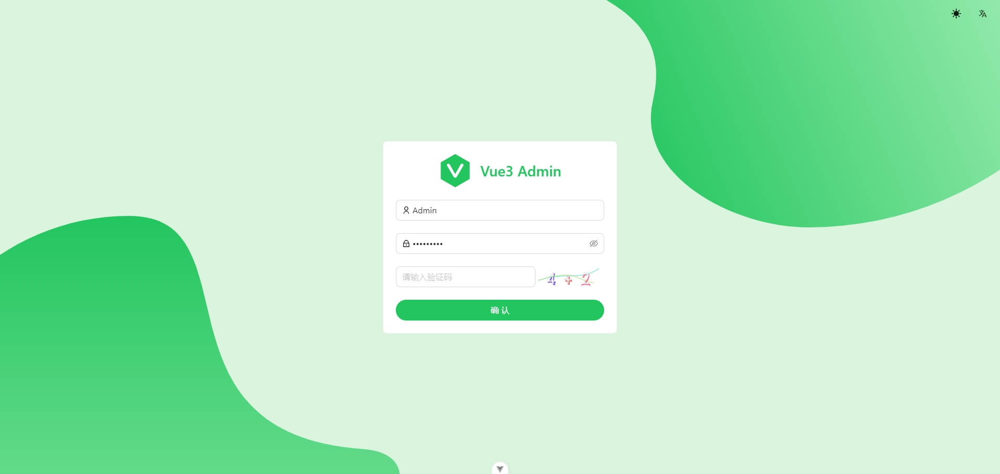 | 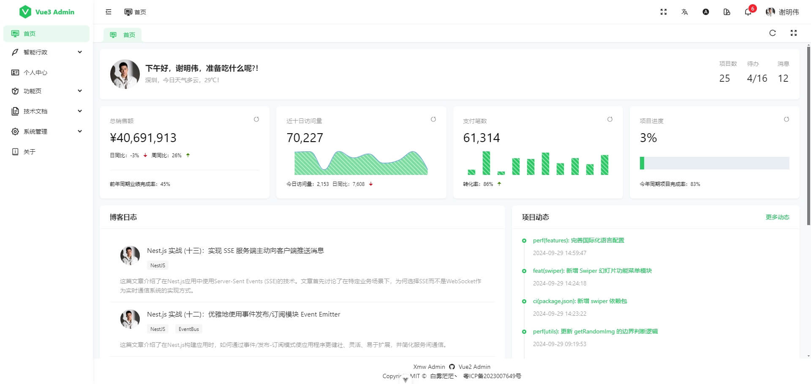 |
| ------------------------------------------------------------ | ------------------------------------------------------------ |
| 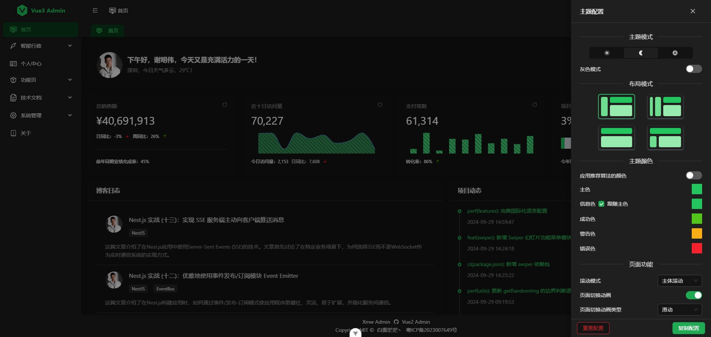 | 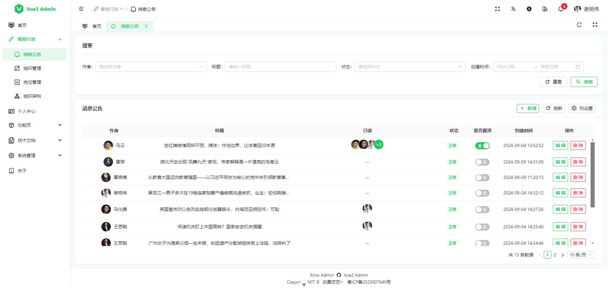 |
| 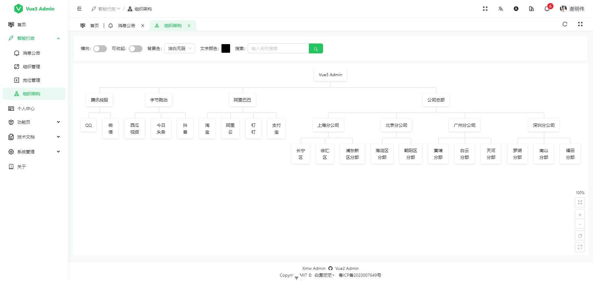 | 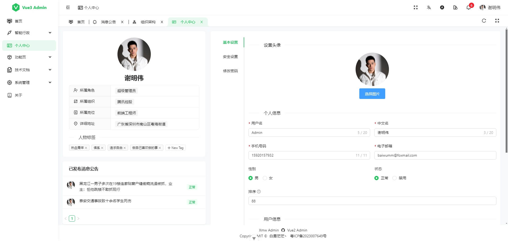 |
| 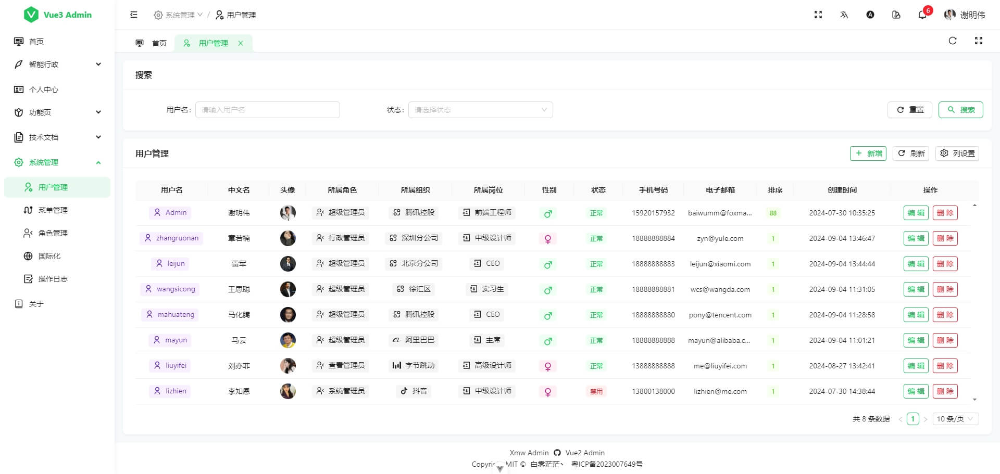 | 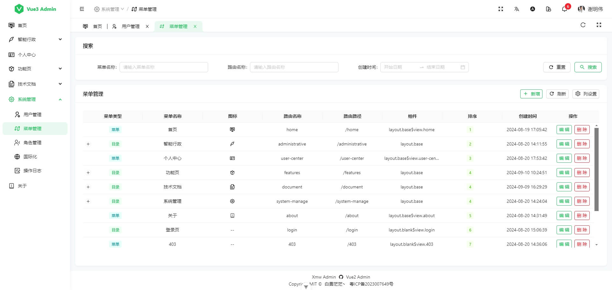 |
| 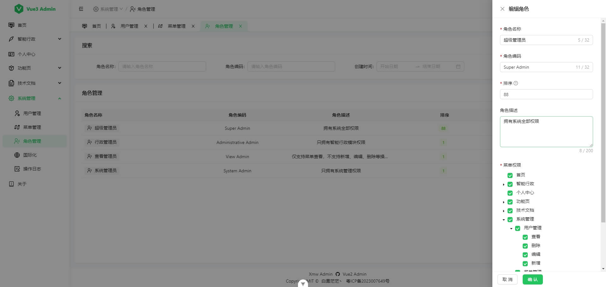 | 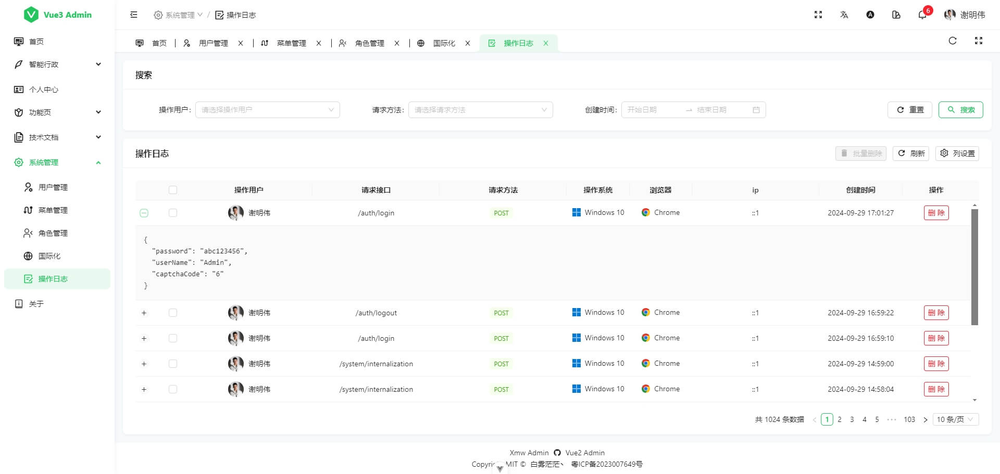 |
| 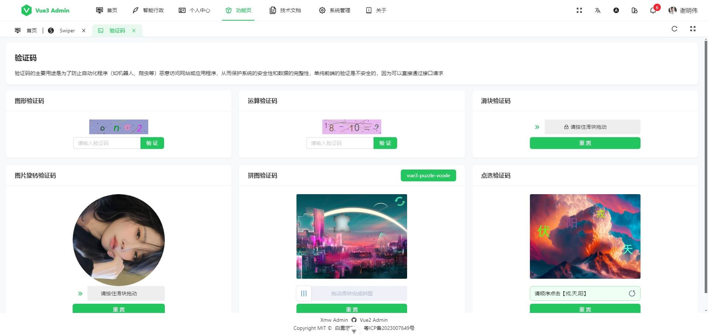 | 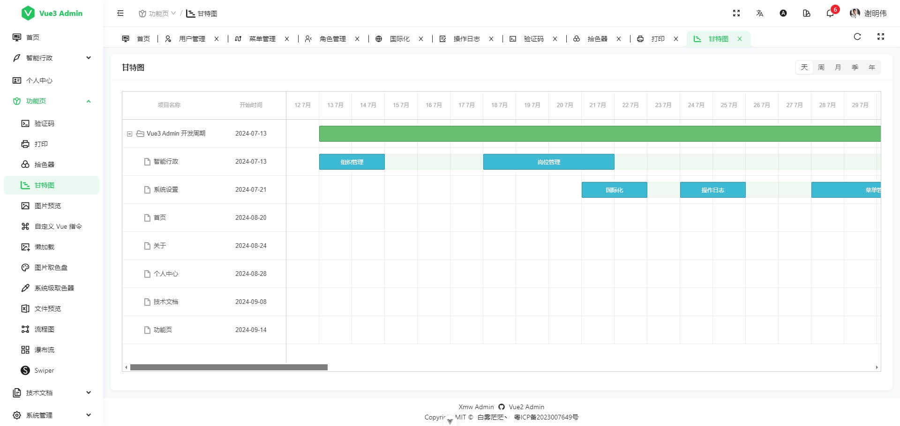 |
| 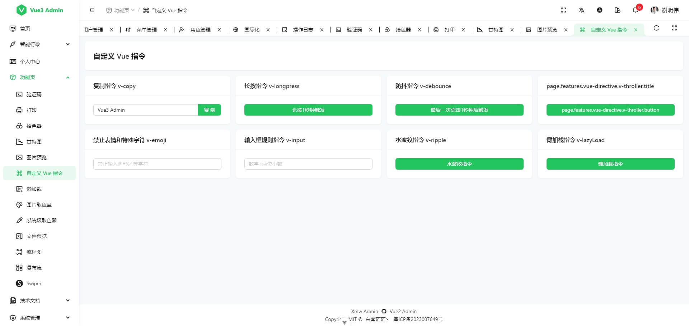 |  |
| 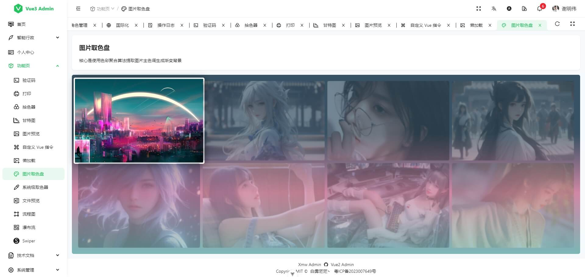 | 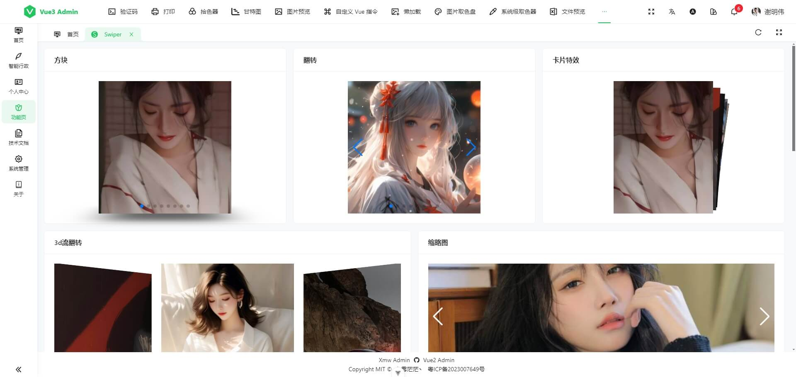 |

## ⭐ Star History

[](https://star-history.com/#baiwumm/Vue3-Admin&Date)